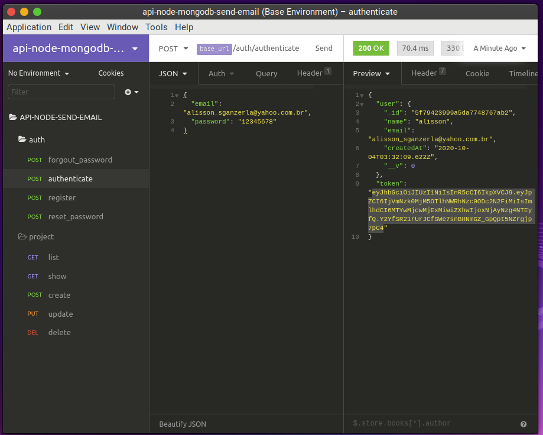
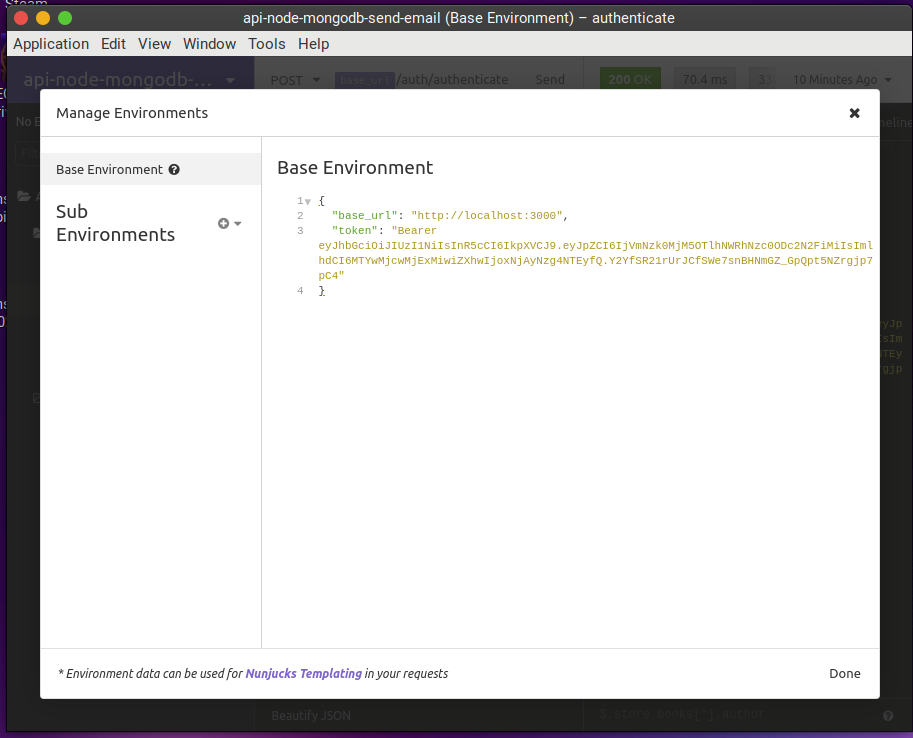

# api-node-mongodb-send-email

## :bookmark: Sobre

Projeto para testar operações de cadastro e gerenciamento de usuários com envio de email utilizando Sendgrid e base de dados MongoDB.

## Índice

- Índice
  - [:bookmark: Sobre](#sobre)
  - [:rocket: Tecnologias utilizadas](#tecnologias-utilizadas)
  - [:memo: Pré-requisitos](#require)
  - [:fire: Como rodar este projeto](#run)
  - [:trophy: Realizar chamadas API com Insomnia](#request)

## :rocket: Tecnologias utilizadas

Neste projeto foram empregadas as seguintes tecnologias:

### Diretas

    * Node.js (12.18.4)
    * express (4.17.1)
    * mongoose (5.10.7)
    * nodemon (2.0.4)
    * bcryptjs (2.4.3)
    * jsonwebtoken (8.5.1)
    * @sendgrid/mail (7.2.6)

### Indiretas

    * Ubuntu (20.04)
    * Yarn (1.22.5)
    * Docker (19.03.13)
    * Insomnia (2020.4.1)
    * Commitizen CLI
    * VSCode
    * MongoDB
    * Sendgrid API

## :memo: Pré-requisitos

### Instalação MongoDB

Com docker instalado utilizar os comandos do [link](https://gist.github.com/sganzerla/936fa20d3332c6107333e9aa969d5904) para rodar o MongoDB em um container.

### Cliente MongoDB

Para checar as coleções cadastradas no banco de dados pode-se utilizar o plugin oficial [MongoDB](https://marketplace.visualstudio.com/items?itemName=mongodb.mongodb-vscode) no VSCode

## :fire: Como rodar este projeto

Possuir o Yarn instalado na máquina e rodar os comandos dentro da pasta raiz do projeto:

    `
    yarn init
    yarn start
    `

## :trophy: Realizar chamadas API com Insomnia

A controller auth é pública não exigindo token de autenticação.

Já a controller project necessita de um token válido.

### Importar JSON

Importar requisições API no arquivo [json](resources/insomnia/Insomnia_api_node.json)

### Gerar token

Com um usuário já criado, realizar operação de login

### Setar token variável ambiente

Mudar o token da variável de ambiente, mantendo a palavra Bearer e um espaço entre ela e o novo token.

## Próximos passos

- converter para typescript
- refatorar serviço de envio de email
- criar integração com outros player de envio de email:
  - sparkpost
  - mailchimp
  - mandrill
  - ses
- criar integração com player de envio de sms
  - twilio
- refatorar router
- criar controller task